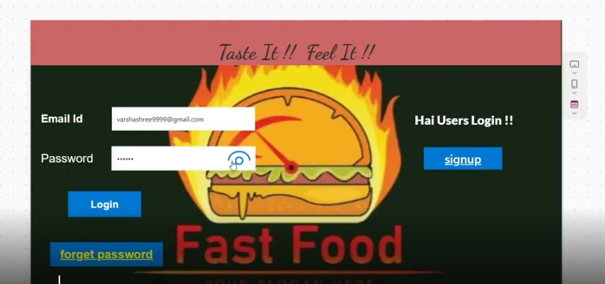
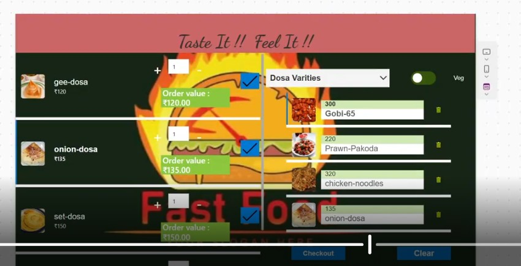
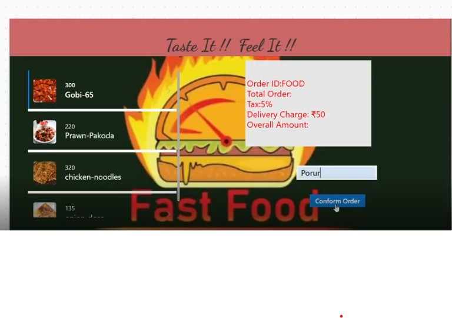
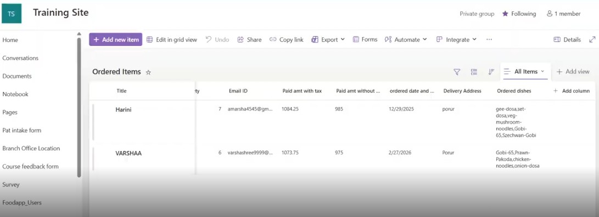
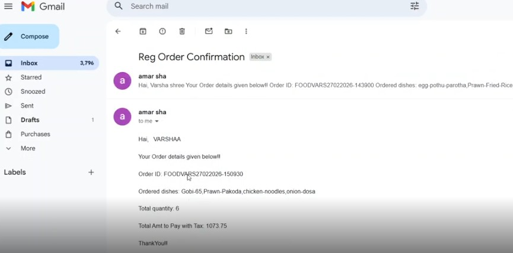

# Food-Ordering-app-
A Food Ordering App built using Power Apps with SharePoint as a data source and automated workflows using Power Automate.

The Food Ordering App is a Power Apps-based application designed to provide a seamless and user-friendly food ordering experience. Users can browse menu items, add items to their cart, and place orders efficiently.

This application uses SharePoint as the backend data source and Power Automate for workflow automation, enabling smooth order processing and real-time tracking.

Features
- User authentication using Patch and LookUp functions
- Dynamic menu display using Gallery and Filter functions
- Add/remove items to cart using Collections
- Order placement and management
- Real-time order tracking using Power Automate flows
- Data storage and management using SharePoint lists

 Technologies Used
- Microsoft Power Apps (Canvas App)
- Power Automate
- SharePoint (Data Source)
- Collections

Key Highlights
- User-friendly and interactive UI
- Efficient data management using SharePoint
- Automated workflow for order processing
- Real-time order status tracking
- Scalable solution for small-scale food ordering systems

🎥 Demo Video https://drive.google.com/file/d/16dNJPabDcMa0RvxAIc63Bn8N7YIze8UK/view?usp=sharing

## 📸 Screenshots

**1. Login Screen**

**2. Food Ordering Screen**

**3. Order Confirm Screen**

**4. SharePoint Orders Data**

**5. Order Confirmation Mail**

